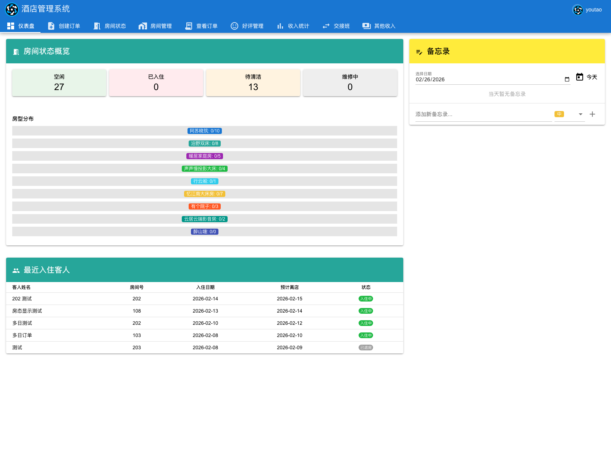
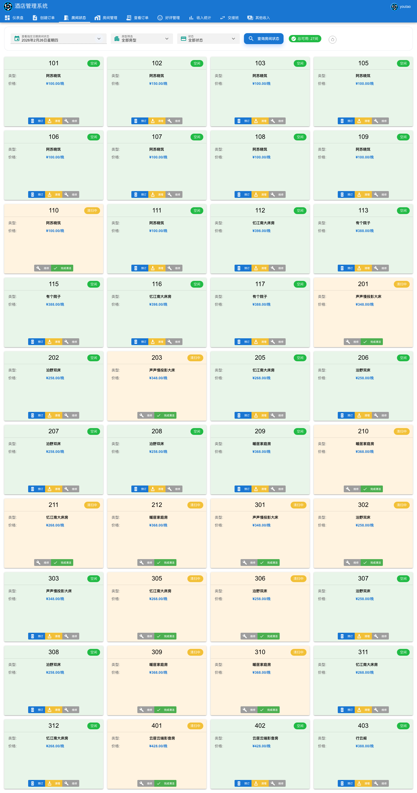
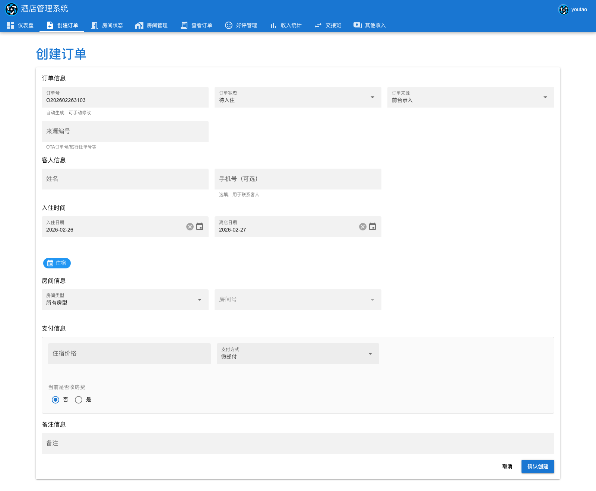
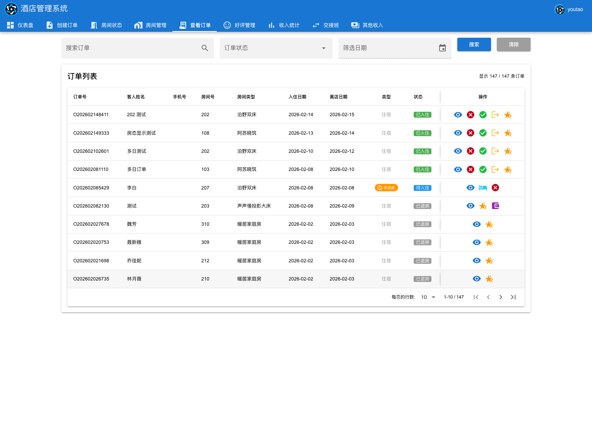
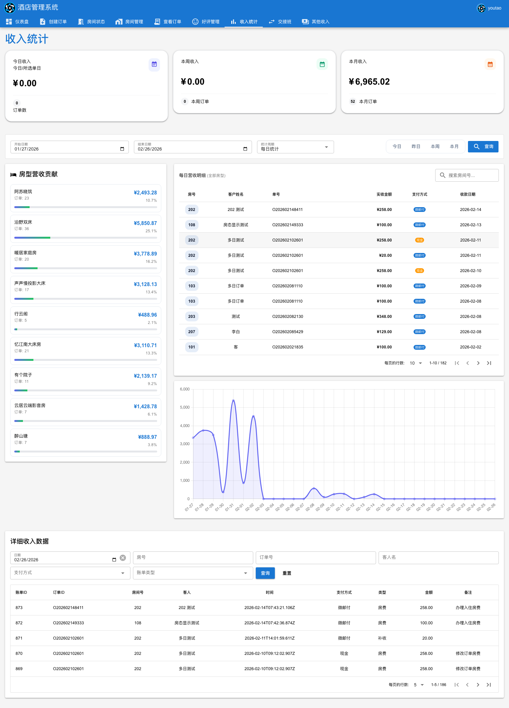
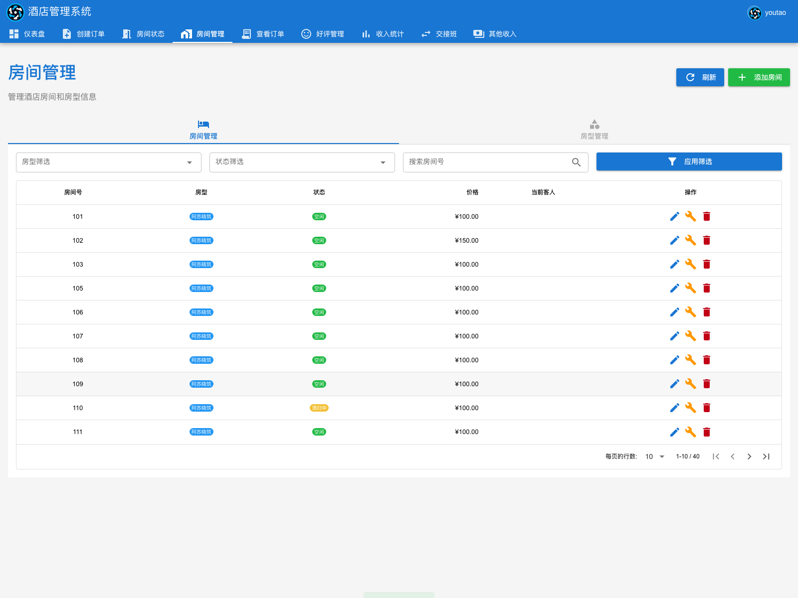
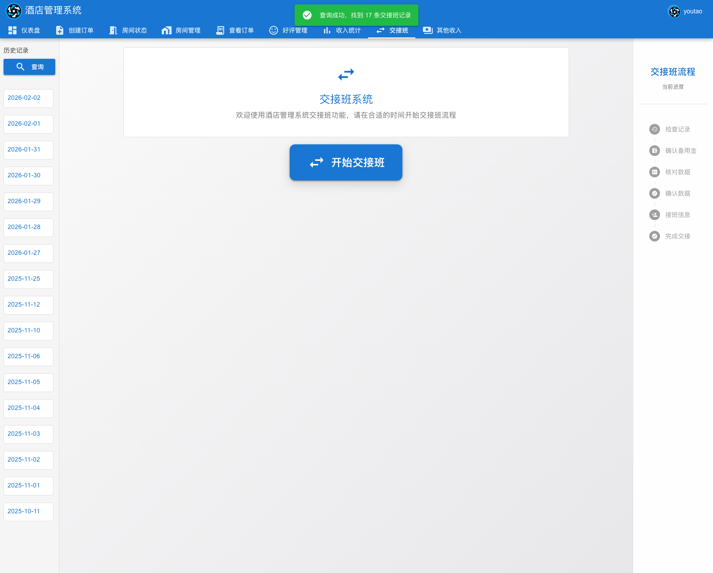

# 酒店经营管理系统

酒店经营管理系统是一个基于 Vue 3、Quasar、Express 和 PostgreSQL 的全栈项目，用于管理酒店/民宿的房间、房态、订单、账单、收入、交接班和渠道联调流程。

项目采用 npm workspaces 管理前后端。前端负责页面交互、表单状态和数据展示；后端负责业务校验、订单状态流转、房态冲突校验、金额拆分、押金退款、渠道签名等核心规则。



## 功能概览

- 房间和房型维护。
- 单日房态和 14 天房态日历。
- 订单创建、快速入住、入住、退房、提前退房、续住、换房、取消订单。
- 押金退款、金额调整、房费和押金多支付方式拆分。
- 收入统计、详细账单、其他收入登记。
- 交接班核对、历史交接班记录、每日备忘录。
- 好评邀约和评价状态管理。
- OTA 渠道订单、库存接口和签名校验。
- 抖音房型匹配、售卖套餐、价量态通知和外部回调/SPI 联调入口。
- 后端 Jest 测试、Playwright E2E 测试和 GitHub Actions CI。

## 系统截图

| 房态日历 | 创建订单 |
| --- | --- |
|  |  |

| 订单管理 | 收入统计 |
| --- | --- |
|  |  |

| 房间管理 | 交接班 |
| --- | --- |
|  |  |

## 模块说明

### 订单与房态

- 创建待入住订单、快速入住、按日房价拆分、房费/押金多支付方式拆分。
- 查看订单列表和详情，支持按订单号、客人、手机号、房号、状态和日期筛选。
- 办理入住、正常退房、提前退房、取消订单、续住、整单换房、按日换房、退押金、金额调整。
- 房态页支持单日房态、14 天房态日历、房型/状态/关键词筛选，以及清扫、维修、完成清洁等现场操作。
- 房间管理支持房间、房型基础资料维护，并与房态和库存可用性联动。

### 财务与运营

- 收入统计看板：单日、本周、本月收入，收入趋势，房型收入贡献，详细账单查询。
- 交接班：统计现金、微信、微邮付和其他支付方式，支持交接班核对、历史记录和备忘。
- 其他收入：登记非房费收入，纳入经营统计。
- 每日自动账单任务：默认每天 18:00 扫描待入住/预订订单，为当天住宿生成房费账单，避免漏记。

### 渠道与评价

- OTA API：提供渠道订单创建、库存查询、库存配额写入，支持 HMAC-SHA256 签名、时间窗校验和 nonce 防重放。
- 抖音联调：提供房型匹配、售卖套餐管理、价量态通知、`/douyin/webhooks`、`/douyin/spi/price-volume`、`/douyin/spi/bookable` 等入口。
- 好评管理：管理可邀约订单、待设置评价和历史评价，统计好评数量与好评率。

## 技术栈

| 层级 | 技术 |
| --- | --- |
| 前端 | Vue 3、Quasar、Pinia、Axios、Chart.js、Material Icons |
| 后端 | Node.js、Express 5、AJV、JWT(jsonwebtoken)、bcrypt、node-cron |
| 数据 | PostgreSQL、Redis |
| 测试 | Jest、Supertest、Playwright |
| 工程 | npm workspaces、Docker Compose、GitHub Actions、nodemon、concurrently |

## 架构说明

```text
hotel-management/
├── frontend/                 # Quasar SPA
│   └── src/
│       ├── pages/            # 页面模块：订单、房态、收入、交接班等
│       ├── components/
│       ├── stores/           # Pinia
│       └── router/
├── backend/                  # Express API
│   ├── app.js                # 中间件、JWT 鉴权、路由注册、静态资源托管
│   ├── modules/              # 页面/业务导向模块
│   ├── routes/               # 渠道、账单、交接班等路由
│   ├── database/             # PostgreSQL 表定义与 Redis 连接
│   └── appSettings/          # 配置与定时任务
├── e2e/                      # Playwright E2E
├── docs/                     # 接口文档、操作手册、系统截图
├── compose.yaml              # PostgreSQL、Redis、backend、E2E
└── package.json              # npm workspaces 根配置
```

后端模块通常按以下边界组织：

```text
backend/modules/<feature>/
├── <feature>.routes.js       # 公开 API 路由
├── <feature>.controller.js   # 请求/响应与错误映射
├── <feature>.validator.js    # 入参归一化与 schema 校验
├── <feature>.service.js      # 业务规则、状态流转、事务编排
├── <feature>.repository.js   # SQL 与数据访问
└── __tests__/                # 模块测试
```

## 快速开始

### 环境要求

- Node.js 20（仓库 `.nvmrc` 指定为 `20`）
- npm 6.13+
- PostgreSQL 17 或兼容版本
- Redis 7 或兼容版本

### 本地开发

```bash
npm install
cp dev.env.template dev.env
```

根据本地数据库和 Redis 修改 `dev.env` 后初始化数据库：

```bash
npm run db:init
```

启动前后端：

```bash
npm start
```

- 前端：`http://localhost:9000`
- 后端：`http://localhost:3000`
- 健康检查：`http://localhost:3000/api/hup`

也可以分别启动：

```bash
npm run dev:backend
npm run dev:frontend
```

### Docker

```bash
docker compose up -d --build
docker compose logs -f backend
```

Docker 默认会启动 PostgreSQL、Redis 和后端服务。更多说明见 [DOCKER.md](./DOCKER.md)。

## 常用命令

| 命令 | 说明 |
| --- | --- |
| `npm start` | 同时启动前端和后端开发服务 |
| `npm run dev:frontend` | 启动 Quasar 前端 |
| `npm run dev:backend` | 启动 Express 后端 |
| `npm run build` | 构建前端产物 |
| `npm run test` | 运行后端 Jest 测试 |
| `npm run test:watch` | Jest watch 模式 |
| `npm run test:coverage` | 生成 Jest 覆盖率 |
| `npm run test:e2e` | 运行 Playwright E2E |
| `npm run test:e2e:ui` | 打开 Playwright UI |
| `npm run db:init` | 初始化 PostgreSQL 表结构 |
| `npm run db:migrate` | 执行数据库迁移 |
| `npm run export-schema` | 导出数据库结构 |
| `npm run export-all` | 导出数据库结构与数据 |

## 测试覆盖

- 后端模块测试位于 `backend/modules/**/__tests__/`。
- 传统后端集成测试位于 `backend/tests/`。
- E2E 用例位于 `e2e/`，覆盖认证、快速入住、房态、房间管理、订单管理、交接班和其他收入。
- CI 配置位于 `.github/workflows/test.yml` 和 `.github/workflows/playwright.yml`，测试环境会启动 PostgreSQL 与 Redis 服务。

运行后端测试：

```bash
npm run test
```

运行 E2E：

```bash
npm run test:e2e
```

## 配置说明

本地开发前复制：

```bash
cp dev.env.template dev.env
```

关键配置：

| 变量 | 说明 |
| --- | --- |
| `NODE_ENV` / `NODE_PORT` | 后端运行环境与端口 |
| `POSTGRES_HOST` / `POSTGRES_PORT` / `POSTGRES_USER` / `POSTGRES_PASSWORD` / `POSTGRES_DB` | PostgreSQL 连接 |
| `REDIS_HOST` / `REDIS_PORT` / `REDIS_PW` | Redis 连接 |
| `APP_URL` / `APP_NAME` | 应用地址与名称 |
| `JWT_SECRET` | 员工登录态 JWT 签名密钥（生产必填，dev/test 缺省时回落到 `APP_NAME`） |
| `AUTO_BILL_*` | 自动账单任务配置 |
| `OTA_*` | OTA 渠道签名、防重放和开关配置 |
| `PLUGIN_*` | 插件 API 动态签名配置 |

敏感配置只应写入本地 `dev.env`、`.env.test` 或部署环境变量，不要提交到仓库。

## 文档入口

- [网站使用说明书](./docs/网站使用说明书.md)
- [订单管理接口文档](./docs/ViewOrders_接口文档.md)
- [收入统计接口文档](./docs/Revenue_接口文档.md)
- [OTA 接口文档](./docs/OTA_接口文档.md)
- [抖音回调联调文档](./docs/抖音回调联调文档.md)
- [房态模块说明](./backend/modules/room-status/README.md)
- [创建订单模块说明](./backend/modules/order-create/README.md)
- [订单管理模块说明](./backend/modules/order-manage/README.md)
