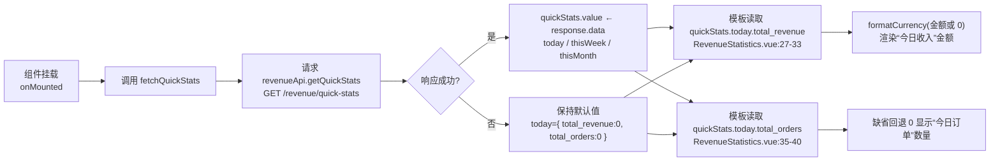

# RevenueStatistics.vue 今日收入显示逻辑

```mermaid
flowchart LR
    A["组件挂载<br/>onMounted"] --> B["调用 fetchQuickStats"]
    B --> C["请求 revenueApi.getQuickStats<br/>GET /revenue/quick-stats"]
    C --> D{响应成功?}
    D -- 是 --> E["quickStats.value ← response.data<br/>today / thisWeek / thisMonth"]
    D -- 否 --> F["保持默认值<br/>today={ total_revenue:0, total_orders:0 }"]
    E --> G["模板读取 quickStats.today.total_revenue<br/>RevenueStatistics.vue:27-33"]
    F --> G
    G --> H["formatCurrency(金额或 0)<br/>渲染“今日收入”金额"]
    E --> I["模板读取 quickStats.today.total_orders<br/>RevenueStatistics.vue:35-40"]
    F --> I
    I --> J["缺省回退 0 显示“今日订单”数量"]
```

Diagram 描述了组件如何在挂载时调用 `fetchQuickStats` 请求 `/revenue/quick-stats` 接口，成功则用响应数据覆盖 `quickStats`，否则保持默认 0 值，再由模板配合 `formatCurrency` 格式化货币并在“今日收入”卡片中展示金额与订单数。
