# 酒店管理系统网站使用说明书

## 1. 文档信息
- 适用系统：酒店管理系统（前端地址 `http://localhost:9000`）
- 编写时间：2026-02-26
- 适用角色：前台、店长、运营、交接班人员

## 2. 登录系统
- 访问地址：`http://localhost:9000/login`
- 输入已注册且已验证邮箱的账号与密码，点击“登录”进入系统。
- 可选“记住我”保存登录邮箱。
- 若提示邮箱未验证，可点击“重新发送验证邮件”。

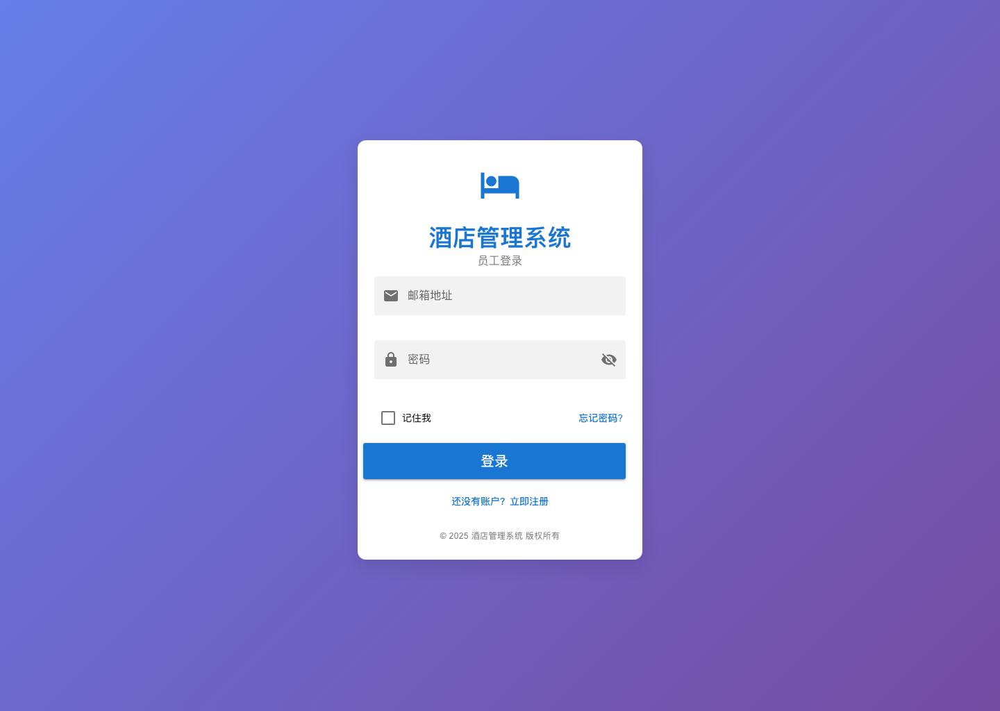

## 3. 顶部导航说明
登录后在顶部标签栏切换模块：
1. 仪表盘（`/Dash-board`）
2. 创建订单（`/CreateOrder`）
3. 房间状态（`/room-status`）
4. 房间管理（`/room-management`）
5. 查看订单（`/ViewOrders`）
6. 好评管理（`/review-management`）
7. 收入统计（`/revenue-statistics`）
8. 交接班（`/handover`）
9. 其他收入（`/other-income`）

## 4. 各模块使用说明

### 4.1 仪表盘（`/Dash-board`）
用途：查看房态总览、最近入住客人、当日备忘录。

主要操作：
1. 点击“空闲/已入住/待清洁/维修中”卡片，可跳转到房间状态页并按状态筛选。
2. 查看“最近入住客人”表，快速确认入住与预计离店信息。
3. 在备忘录区域选择日期，新增、勾选完成、调整优先级、删除备忘。
4. 点击“今天”按钮回到当日备忘。

### 4.2 创建订单（`/CreateOrder`）
用途：创建新订单并完成入住前信息录入。

主要操作：
1. 填写订单信息（订单号、状态、来源、来源编号）。
2. 填写客人信息（姓名、手机号）。
3. 选择入住日期与离店日期。
4. 选择房型与房间号。
5. 设置房价、总价、支付方式、备注。
6. 点击“确认创建”提交。

业务口径：
- 单日订单：第一天入住，第二天退房（1 天）。
- 多日订单：入住到第三天或更晚退房（2 天及以上）。
- 休息房订单：入住日与退房日为同一天。

### 4.3 房间状态（`/room-status`）
用途：按日期查看全部房态，并执行房间现场操作。

主要操作：
1. 使用顶部筛选栏按日期、房型、状态查询。
2. 在房卡上可执行：预订、办理入住、办理退房、设为清扫中、设为维修中、完成清洁、完成维修。
3. 点击房卡可查看房间日历；点击备注按钮可查看客人备注。

### 4.4 房间管理（`/room-management`）
用途：维护房间与房型基础资料。

主要操作：
1. 点击“添加房间”新增房间。
2. 在房间列表按房型、状态、房号筛选。
3. 在房间行执行编辑、设为维修、删除。
4. 切换到“房型管理”标签页，新增/编辑/删除房型。
5. 使用“刷新”同步最新房间与房型数据。

### 4.5 查看订单（`/ViewOrders`）
用途：订单检索与全流程订单操作。

#### 4.5.1 页面功能概览
`ViewOrders` 是订单管理主页面，核心能力：
1. 订单查询与筛选。
2. 订单详情查看。
3. 办理入住、退房、提前退房。
4. 取消订单。
5. 续住（创建新订单）。
6. 退押金。
7. 修改订单（房型/房间/房费/押金/支付方式/备注）。
8. 更换房间（整单换房、按日换房）。
9. 金额调整（补收/退款）。

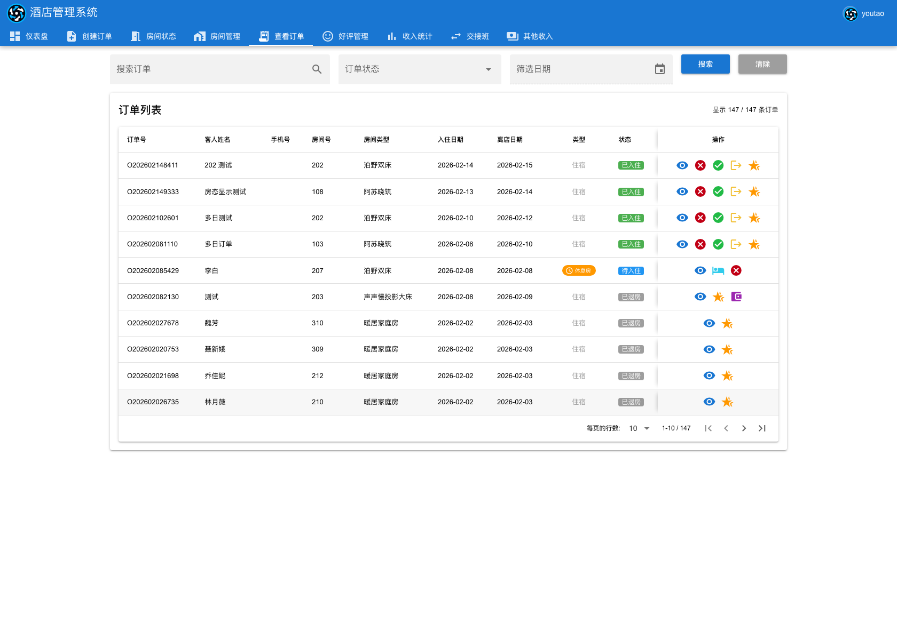

#### 4.5.2 订单状态与可执行操作
| 订单状态 | 列表按钮 | 详情弹窗按钮 |
|---|---|---|
| `pending`（待入住） | 查看详情、办理入住、取消订单 | 办理入住、修改订单、更换房间、金额调整 |
| `checked-in`（已入住） | 查看详情、取消订单、办理退房、提前退房、续住 | 办理退房、提前退房、更改房间、修改订单、金额调整 |
| `checked-out`（已退房） | 查看详情、续住、退押金（有剩余押金时） | 退押金、修改订单、金额调整 |
| `cancelled`（已取消） | 查看详情、退押金（有剩余押金时） | 退押金、金额调整 |

说明：
1. “退押金”按钮只有在状态为 `checked-out`/`cancelled` 且剩余押金 > 0 时显示。
2. “每日房间安排”中的按日换房按钮在订单状态不是 `cancelled`/`checked-out` 时可用。

#### 4.5.3 查询与筛选
1. 在“搜索订单”输入订单号/客人姓名/手机号/房间号。
2. 可选“订单状态”筛选。
3. 可选“筛选日期”（匹配入住日或离店日）。
4. 点击“搜索”执行筛选，点击“清除”重置条件。

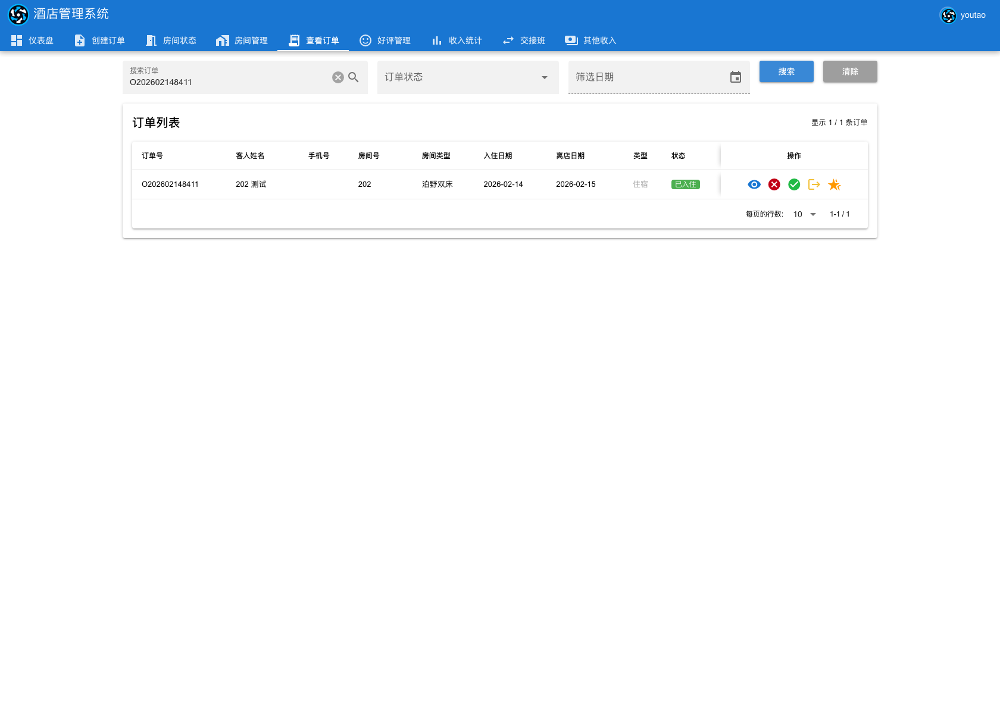

#### 4.5.4 查看订单详情
1. 在订单行点击“查看详情”。
2. 查看基础信息、住客信息、房间信息、财务信息。
3. 若存在多日记录，可查看“每日房间安排”。

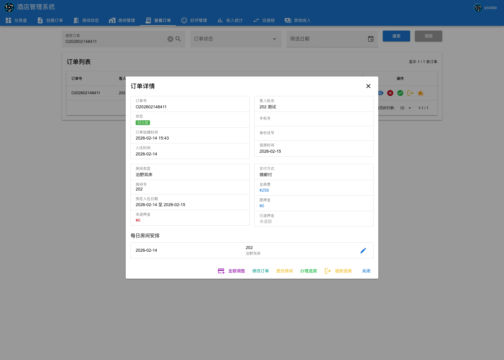

#### 4.5.5 办理入住
1. 在待入住订单点击“办理入住”。
2. 在“确认办理入住”弹窗确认/修改押金。
3. 如启用拆分收款，确保“房费拆分”“押金拆分”金额合计与应收一致。
4. 点击“确认办理入住”。
5. 成功提示“入住成功”，订单状态变为已入住，房间状态变为占用。

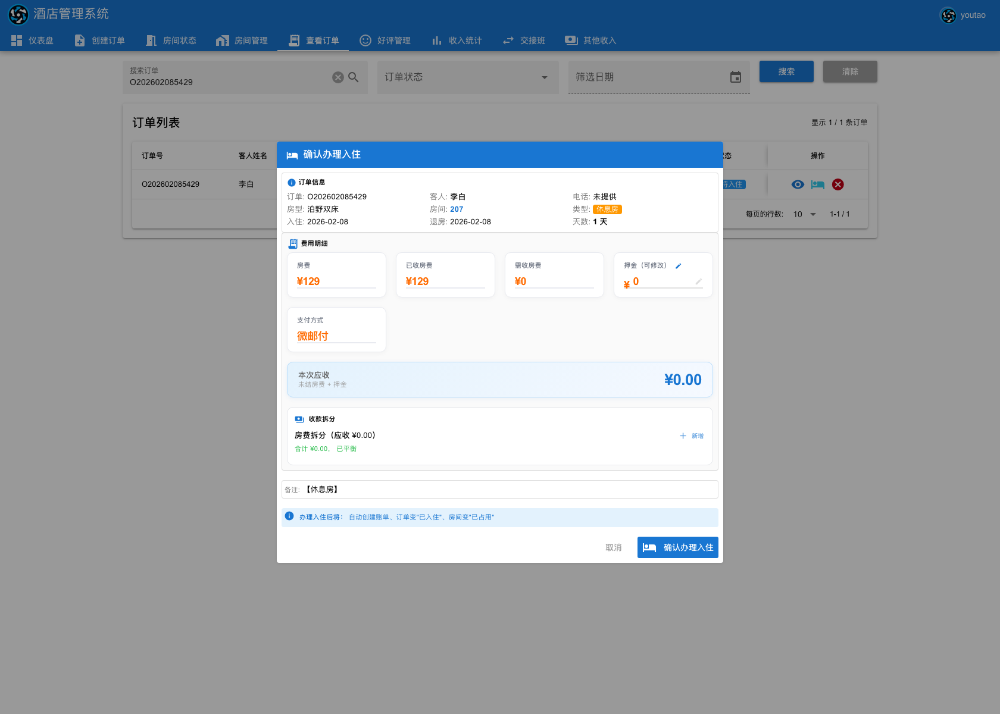

#### 4.5.6 取消订单
1. 在待入住或已入住订单点击“取消订单”。
2. 在确认弹窗点击“确定”。
3. 成功提示“订单已取消”。

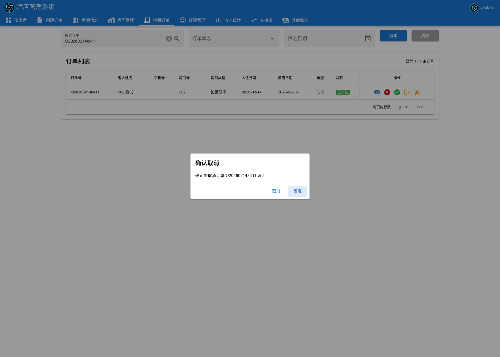

#### 4.5.7 办理退房
1. 在已入住订单点击“办理退房”。
2. 在确认弹窗点击“确定”。
3. 成功提示“退房成功”，订单状态变为已退房，房间状态变为清洁中。

#### 4.5.8 提前退房
1. 在已入住订单点击“提前退房”。
2. 选择“是否入住”：
   - 是：必须填写早于原计划离店时间的“实际退房时间”。
   - 否：按未入住场景结算。
3. 系统自动给出“建议退款”，可手动调整（不能超过建议金额）。
4. 选择退款方式，填写备注（可选），点击“确认提前退房”。
5. 成功提示“提前退房已完成”。

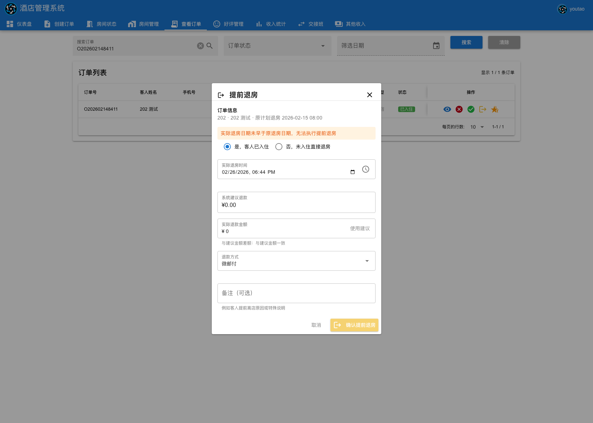

#### 4.5.9 退押金
1. 在已退房/已取消且有剩余押金的订单点击“退押金”。
2. 填写本次退押金额、退款方式、扣除费用（可选）、备注。
3. 点击“确认退押金”，在二次确认弹窗点击“确认退款”。
4. 成功提示“退押金成功”。

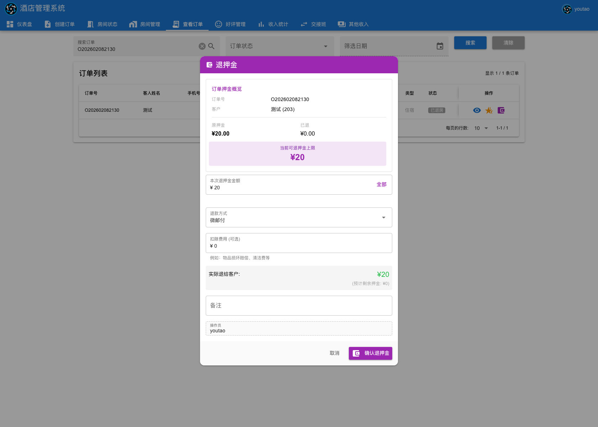

#### 4.5.10 续住
1. 在已入住或已退房订单点击“续住”。
2. 选择续住房间（可点击“继续住原房间”）。
3. 设置续住日期区间、新订单号、客人信息、支付方式、每日房价。
4. 点击“确认续住”。
5. 成功提示“续住订单创建成功”，并生成新订单（状态通常为待入住）。

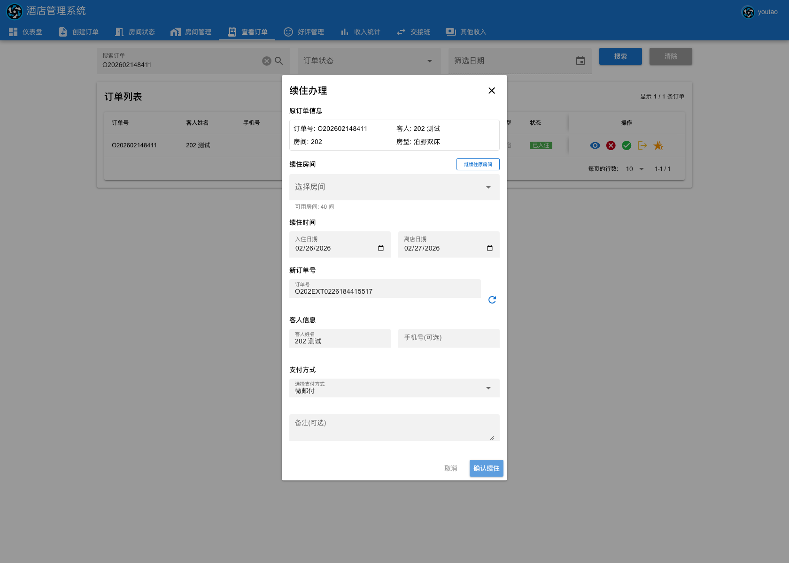

#### 4.5.11 修改订单
1. 进入“订单详情”，点击“修改订单”。
2. 可修改：客人姓名、手机号、房间号、每日房费、押金、支付方式、备注。
3. 点击“保存更改”。
4. 成功提示“订单更新成功”。

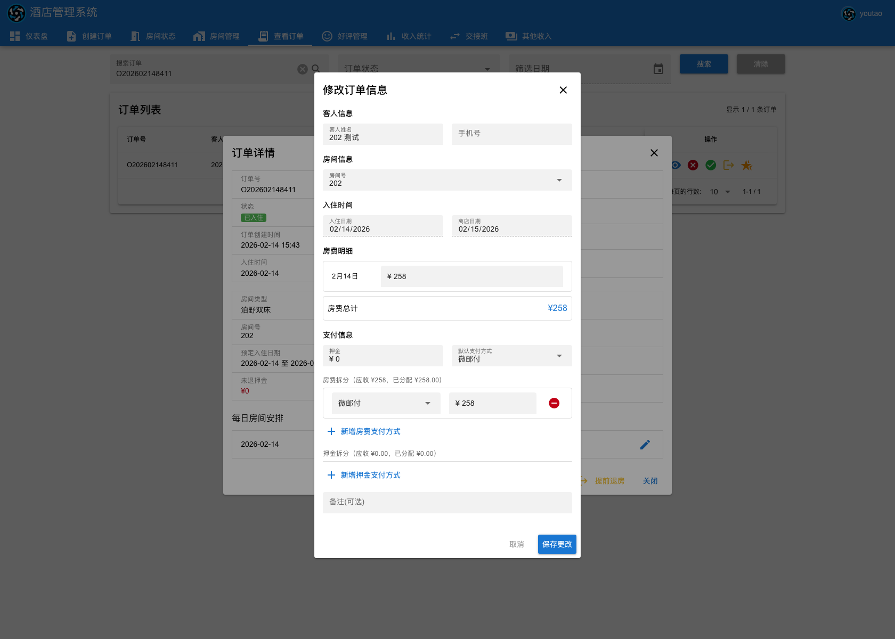

#### 4.5.12 更换房间
整单换房：
1. 在详情中点击“更换房间/更改房间”。
2. 选择新房间，点击“确认更改”。
3. 成功提示“房间更换成功”。

按日换房（多日订单）：
1. 在详情“每日房间安排”点击某天的编辑按钮。
2. 选择当天新房间并确认。
3. 成功提示“房间更换成功”。

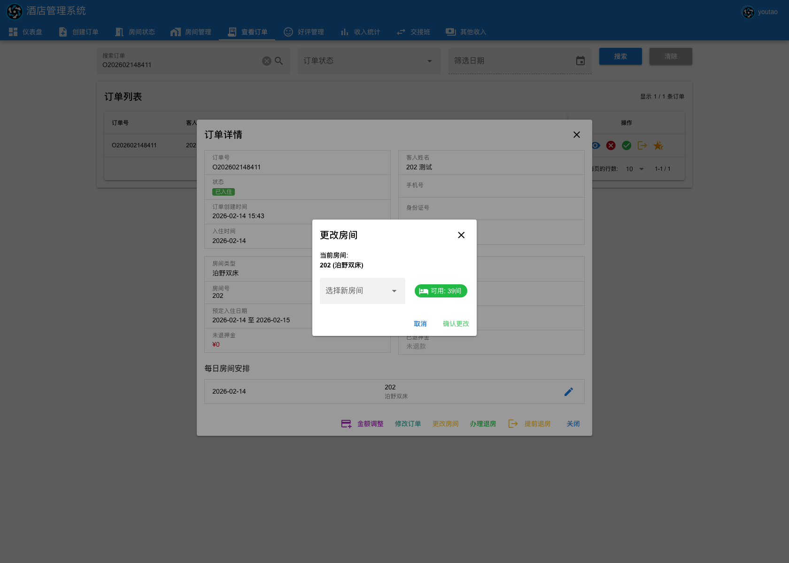

#### 4.5.13 金额调整（补收/退款）
1. 在订单详情点击“金额调整”。
2. 填写调整金额、调整类型（补收/退款）、支付方式、备注。
3. 点击“保存”。
4. 成功提示“金额调整成功！”。

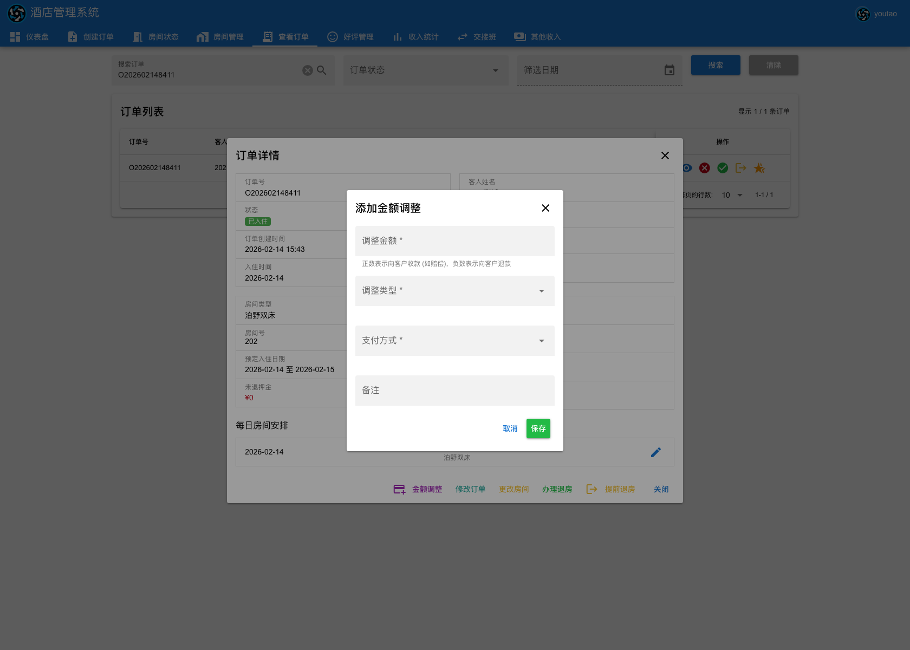

#### 4.5.14 常见失败与处理建议
| 场景 | 常见原因 | 建议处理 |
|---|---|---|
| 入住失败 | 非待入住状态、拆分金额不平衡 | 检查订单状态；确保拆分合计=应收 |
| 提前退房提交按钮不可点 | 实际退房时间不合法、退款方式未选、退款超建议值 | 修正时间与退款金额，补全必填 |
| 退押金失败 | 超过可退押金、订单状态不允许 | 检查剩余押金与订单状态 |
| 更换房间失败 | 新房间不可用/冲突/参数缺失 | 重新选择空闲且无冲突房间 |
| 续住失败 | 新订单号不合规、房价或日期不合法 | 检查订单号长度与日期区间、每日房价 |

### 4.6 好评管理（`/review-management`）
用途：管理好评邀约与评价状态。

主要操作：
1. 在“可邀请好评”页对符合条件客人发起邀约。
2. 在“待设置评价”页标记正评或负评。
3. 在“所有评价”页查看历史评价记录。
4. 顶部统计卡展示可邀约数、待设置数、好评数量与好评率。

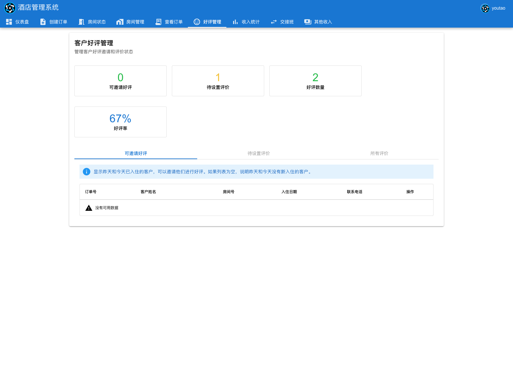

### 4.7 收入统计（`/revenue-statistics`）
用途：查看收入看板、按时间统计、查看详细账单。

主要操作：
1. 查看三张统计卡：单日收入、本周收入、本月收入。
2. 使用筛选栏设置开始/结束日期、统计周期并查询。
3. 在“房型营收贡献”中按房型筛选趋势图。
4. 在“详细收入数据”表按日期、订单号、支付方式、账单类型查询。

关键口径：
- 单日收入默认展示“今日”，若用户选择了单日日期，则首卡显示所选日期收入。
- 今日收入 = `stay_date=当天` 且 `status!=cancelled` 的订单 `total_price` 汇总。
- 本周、本月收入始终按当前自然周与当前自然月统计。

### 4.8 交接班（`/handover`）
用途：完成班次交接并归档交接记录。

主要操作：
1. 点击“开始交接班”。
2. 按流程完成 6 个步骤：
   - 检查昨日交接记录
   - 确认备用金
   - 核对交接数据
   - 确认交接数据
   - 输入接班人信息
   - 完成交接并登出
3. 可在左侧“历史记录”查看过往交接记录详情。

交接账单口径：
- 交接班核对数据来自“按日期查询账单”接口（`bills` 关联 `orders`）。
- 日期按 `create_time` 的日期过滤。
- 排除 `pay_way='平台'` 的账单。
- 默认查询前一天。

### 4.9 其他收入（`/other-income`）
用途：录入租车或杂项收入。

主要操作：
1. 填写客人姓名（可选）。
2. 填写金额（支持正数收入、负数支出；不可为 0）。
3. 选择支付方式。
4. 确认收入时间（可在日期时间弹窗调整）。
5. 填写备注并点击“提交录入”。

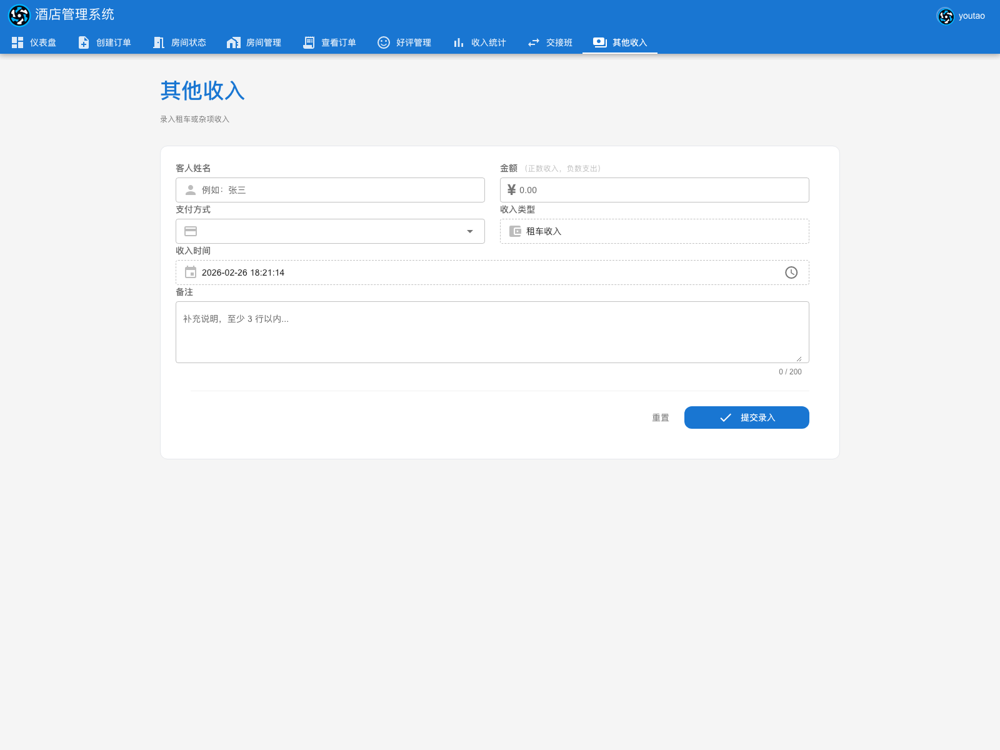

## 5. 推荐日常操作顺序
1. 上班先看“仪表盘”与“房间状态”。
2. 有新客时在“创建订单”录单，随后在“查看订单/房间状态”办理入住。
3. 营业中使用“查看订单”处理退房、提前退房、续住、退押金。
4. 每日关注“收入统计”和“好评管理”。
5. 班次结束前进入“交接班”完成完整交接流程。

## 6. 常见问题
- 登录后跳回登录页：通常是登录状态失效，请重新登录。
- 看不到某模块数据：先检查筛选条件与日期。
- 提交按钮不可用：通常是必填项未填或金额/日期校验未通过。
- 交接班“确认核对”不可点：需先逐条/一键确认各分区数据。
