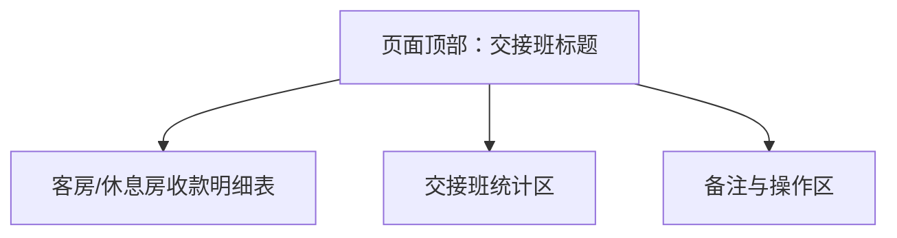

# 交接班功能页面设计图

## 1. 页面结构概览

- 页面标题：交接班
- 主要分为三大区块：
  1. 客房/休息房收款明细表
  2. 交接班统计区
  3. 备注与操作区

---

## 2. 设计草图（结构示意）



---

## 3. 详细区块说明

### 3.1 客房/休息房收款明细表
- 表格字段：
  - 房号
  - 单号
  - 房费收款（现金/微信/支付宝等）
  - 押金（现金/微信/支付宝等）
  - 收款总额
  - 开房/退房时间
- 支持切换"客房"与"休息房"两种模式，分别显示不同房型的收款明细。
- 支持自动统计每种支付方式的总额。

### 3.2 交接班统计区
- 统计内容：
  - 备用金
  - 客房收入
  - 休息房收入
  - 租车收入（如有）
  - 合计
  - 客房退押
  - 休息退押
  - 留存款
  - 交接款
- 统计表格下方可显示"好评/大美卡/开房/休息房"等特殊统计项。
- 统计区右下角显示"收银员签名"与"备注"。

### 3.3 备注与操作区
- 备注录入框（多行文本）
- 操作按钮：
  - 保存交接班
  - 打印交接单
  - 导出Excel

---

## 4. 交互与功能说明
- 支持自动汇总各类收款方式金额。
- 支持录入、修改、删除每条收款明细。
- 支持交接班数据的保存、打印、导出。
- 支持历史交接班记录查询。

---

## 5. 视觉风格建议
- 采用卡片式分区，主色调与系统风格一致。
- 表格区域采用横向滚动，适配移动端。
- 统计区突出合计金额。
- 操作按钮固定在页面底部或右侧，便于操作。

---

## 6. 示例页面布局（简化版）

```
┌──────────────────────────────┐
│         交接班（标题）         │
├─────────────┬─────────────┤
│ 客房/休息房收款明细表 │ 交接班统计区 │
│  [表格]         │  [统计表]     │
├─────────────┴─────────────┤
│         备注与操作区           │
│  [备注输入] [保存] [打印] [导出] │
└──────────────────────────────┘
```

---

## 7. 备注
- 设计图仅为结构与功能参考，具体UI可根据实际系统风格调整。
- 可根据实际业务需求增减字段。 